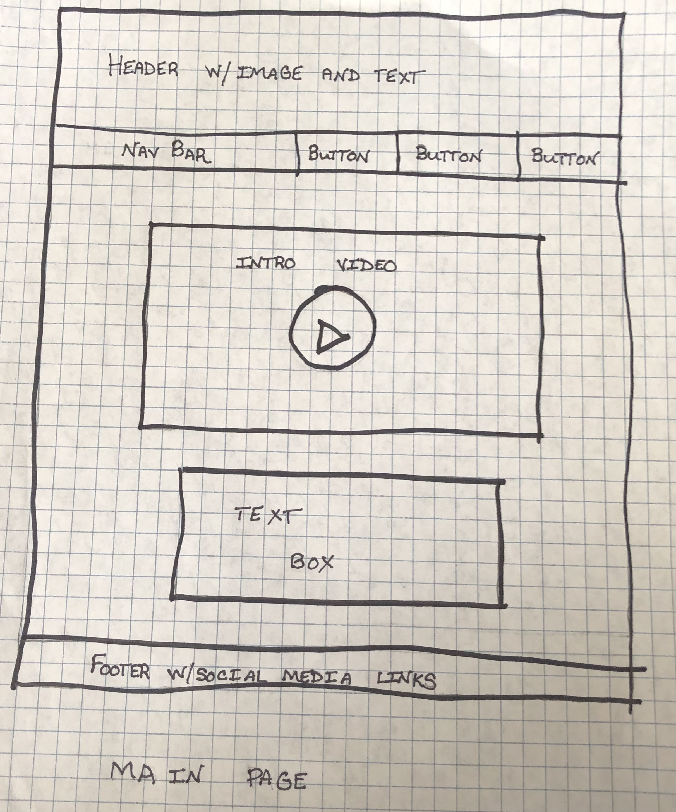
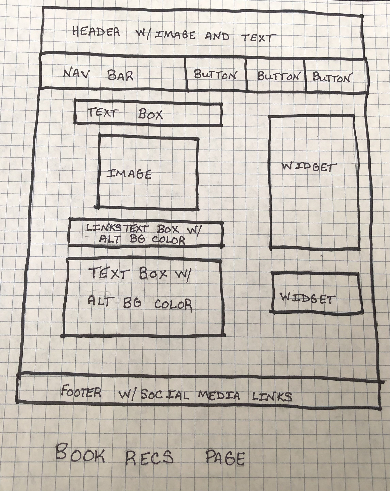
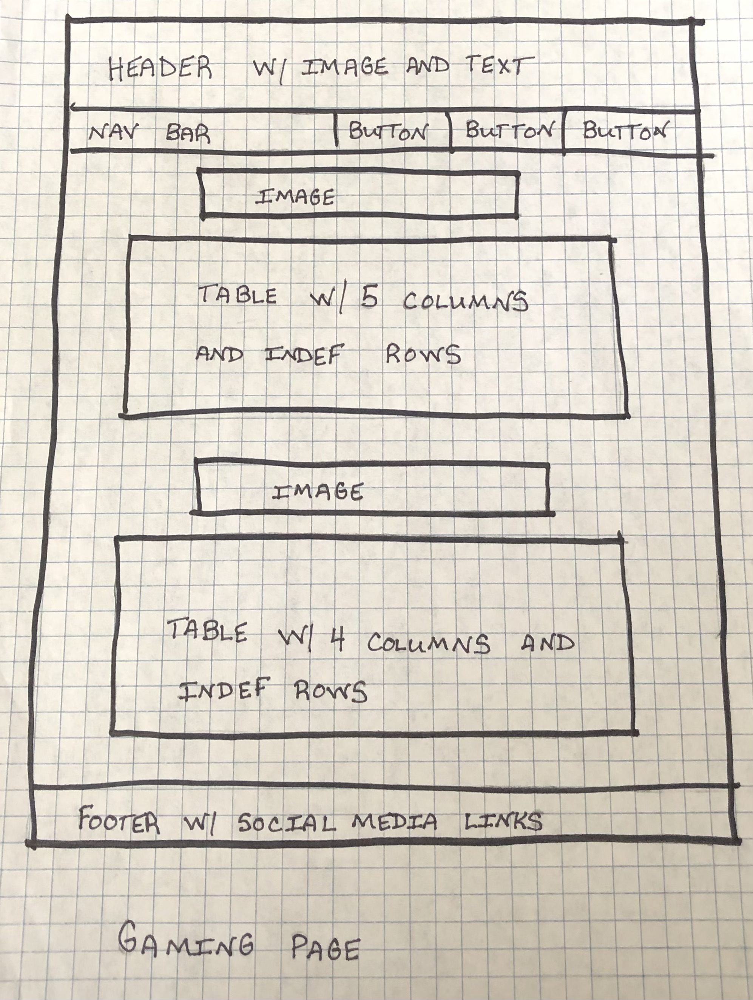

# Kaitlyn Theisen's INF6420 Project

A site to display my reading and video game playing activity. 

# Wireframes

Here are some wireframes to show how the the site layout and structure could look.

Header - will include site name on an image background

Navigation menu - will include links to the main, video games, and books pages

Main content - will inlcude a video introduction and text bio about me

Footer - will include copyright info and icon links to my social media

Header - will include site name on an image background

Navigation menu - will include links to the main, video games, and books pages

Main content - will include a Goodreads widget for my recently read books, a Goodreads widget for my Goodreads book challenge, and reviews of my favorite books with images and buy links

Footer - will include copyright info and icon links to my social media

Header - will include site name on an image background

Navigation menu - will inlcude links to the main, video games, and books pages

Main content - will include images of the consoles I play on with tables underneath to name and rate games I have played

Footer - will include copyright info and icon links to my social media